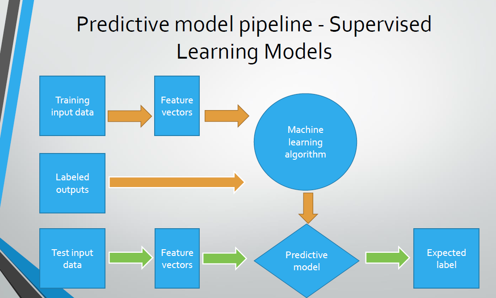
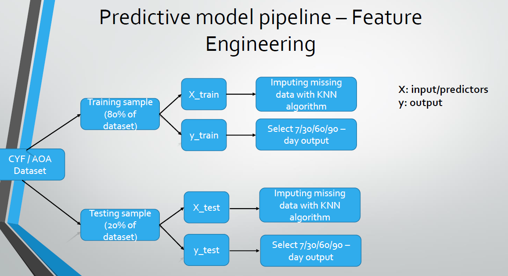
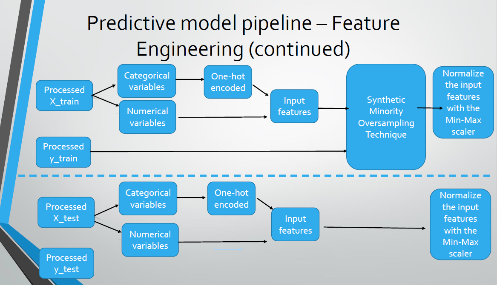
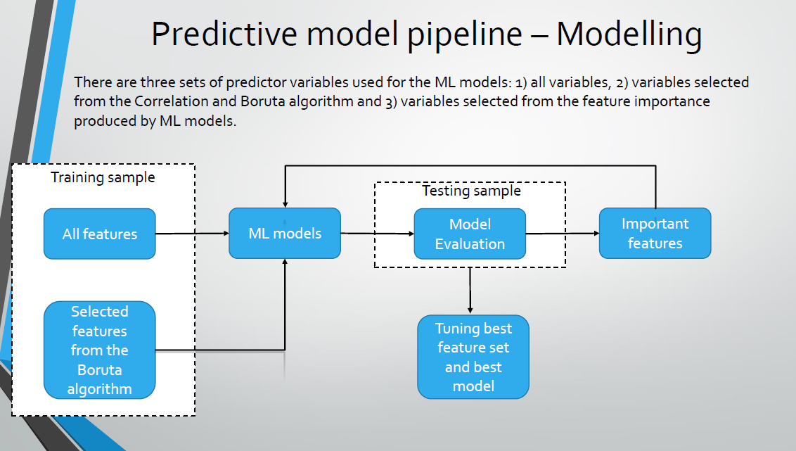
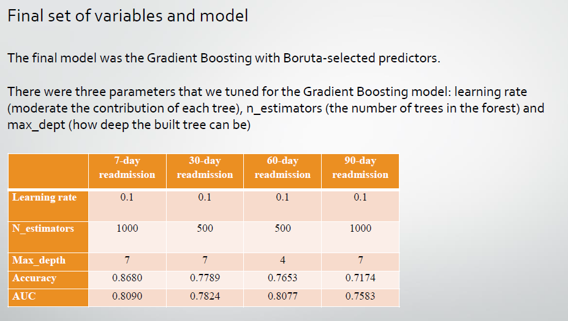
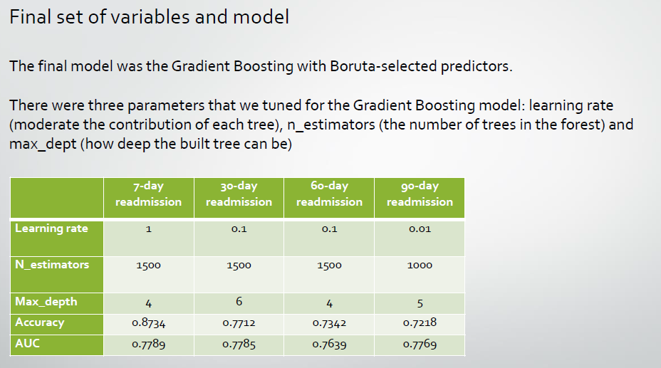
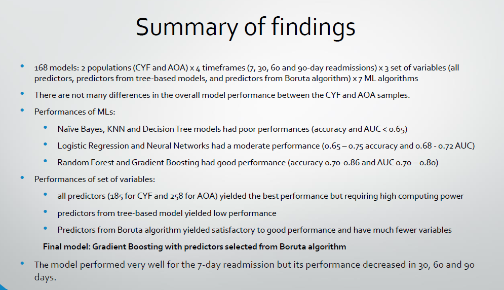

# Project Title: Early-Psychiatric-Rehospitalization-Prediction

## Overview
This repository is my Georgia Tech master program (OMSA) practicum project. 
The aim of the project is to develop a data pipeline that utilizes 7 machine learning models to to predict 7/30/60/90-day psychiatric readmissions as well as identifying influencing factors for both the youth (CYF) and the adult (AOA) systems of care in San Diego County. Please refer to the paper for further explanation on the data source, methodology, model architecture and results.

The directory structure of this repository is shown below.
```
├── Codes
│   ├── AOA
│   │   ├── 7-day rehospitalization
│   │   │     ├── Feature Engineering.ipynb
│   │	│     └── Machine Learning Models.ipynb 
│   │   ├── 30-day rehospitalization
│   │	│     ├── Feature Engineering.ipynb
│   │	│     └── Machine Learning Models.ipynb
│   │   ├── 60-day rehospitalization
│   │	│     ├── Feature Engineering.ipynb
│   │	│     └── Machine Learning Models.ipynb
│   │   ├── 90-day rehospitalization
│   │   │     ├── Feature Engineering.ipynb
│   │	│     └── Machine Learning Models.ipynb
│   │   ├── Data imputation.ipynb
│   │   └── EDA.ipynb
│   │   
│   ├── CYF
│   │   ├── 7-day rehospitalization
│   │   │     ├── Feature Engineering.ipynb
│   │	│     └── Machine Learning Models.ipynb 
│   │   ├── 30-day rehospitalization
│   │	│     ├── Feature Engineering.ipynb
│   │	│     └── Machine Learning Models.ipynb
│   │   ├── 60-day rehospitalization
│   │	│     ├── Feature Engineering.ipynb
│   │	│     └── Machine Learning Models.ipynb
│   │   ├── 90-day rehospitalization
│   │   │     ├── Feature Engineering.ipynb
│   │	│     └── Machine Learning Models.ipynb
│   │   ├── Data imputation.ipynb
│   │   └── EDA.ipynb 
│   │   
│   └── Extract data.sql
├── Docs
    ├── variables name.xlsx
    ├── LOC_list.xlsx   
├── README.md
├── paper.pdf
└── slides.pdf


```

## Data Pipeline and Results

<details>
  <summary>Below are some slides to illustrate the data pipeline design and results from different models. Please see the full report and slide files for more details.</summary>
  
  
  
  
  
  
  
</details>

